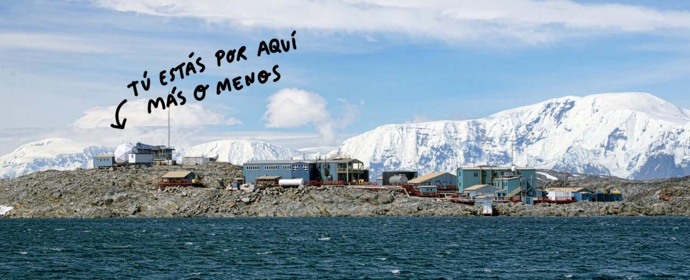

# ¡Hi, Penguins! 🐧

En este repositorio encontrarás **visualizaciones de correlaciones entre variables** usando **diagramas de dispersión** basados en datos de pingüinos.

---
😵 *¿Correlación? ¿Diagramas? ¿Bla bla bla...?* 😵  

--- 

 ¡No te preocupes! A lo largo de este análisis de datos irás comprendiendo cada parte paso a paso.

No necesitas saber nada, solo tener la voluntad de viajar... 

> ¿Qué te parece la **Antártida**? 

Comencemos... voy a necesitar que utilices tu imaginación *(el presupuesto de este readme no da para más)* 

Cierra los ojos estamos viajando al archipiélago Palmer de la Antártida...PUUUUUM

Bien, llegados a este punto ahora tienes que saber que te encuentras bajo el [tratado antártico](https://www.ciencia.gob.es/Organismos-y-Centros/Comite-Polar-Espanol/Tratado-Antartico.html;jsessionid=A025137586B4CCFB1D608323D604080C.1),

Este documento  firmado en Washington el 1 de diciembre de 1959 es una de esa cosas que te hacen no perder la fe en la humanidad...

> 📖Artículo 1: La Antártida se utilizará **exclusivamente para fines pacíficos**. Se prohíbe, entre otras, toda medida de
carácter militar, tal como el establecimiento de bases y fortificaciones militares, la realización de
maniobras militares, así como los ensayos de toda clase de armas.

Bueno ahora que ya acabamos de asentarnos hemos tenido la suerte de cruzarnos con la ivestigadora Kristen Gorman, ella y su equipo han estado recopilando datos sobre pingüinos y les gustaría hacer un analísis de datos... 

¿Nos ponemos a ello?

