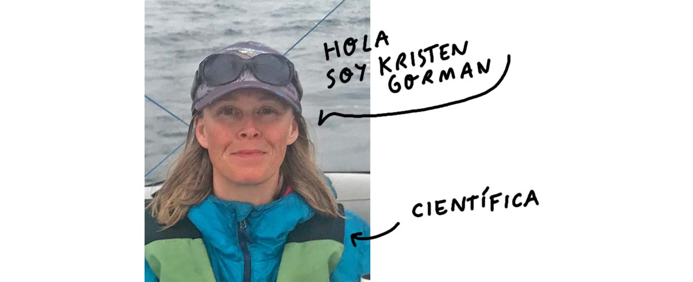

# ¡Hi, Penguins! 🐧

En este repositorio encontrarás **visualizaciones de correlaciones entre variables** usando **diagramas de dispersión** basados en datos de pingüinos.

---
😵 *¿Correlación? ¿Diagramas? ¿Bla bla bla...?* 😵  

--- 

 ¡No te preocupes! A lo largo de este análisis de datos irás comprendiendo cada parte paso a paso.

No necesitas saber nada, solo tener la voluntad de viajar... 

> ¿Qué te parece la **Antártida**? 

Comencemos... voy a necesitar que utilices tu imaginación *(el presupuesto de este readme no da para más)* 

Cierra los ojos estamos viajando al archipiélago Palmer de la Antártida...PUUUUUM

Bien, llegados a este punto ahora tienes que saber que te encuentras bajo el [tratado antártico](https://www.ciencia.gob.es/Organismos-y-Centros/Comite-Polar-Espanol/Tratado-Antartico.html;jsessionid=A025137586B4CCFB1D608323D604080C.1),

Este documento  firmado en Washington el 1 de diciembre de 1959 es una de esa cosas que te hacen no perder la fe en la humanidad...

> 📖Artículo 1: La Antártida se utilizará **exclusivamente para fines pacíficos**...

Bueno ahora que ya acabamos de asentarnos hemos tenido la suerte de cruzarnos con la ivestigadora Kristen Gorman, ella y su equipo han estado recopilando datos sobre pingüinos y les gustaría hacer un analísis de datos... 

[¿Nos ponemos a ello?](./penguins-data-analisis.ipynb)

